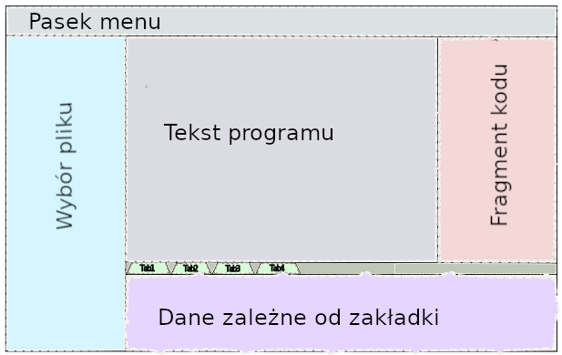

# Part 1: Application Interface Mockup

## Grading Requirements

Opened: Monday, March 1, 2021
Due: Monday, March 20, 2023

## Description:

The goal of this course's major project is to develop a web application capable of compiling programs for 8-bit processors. The application should allow users to input C code files (through upload or editing), set compiler options, and obtain the compiled program's output. The target language for compilation is C, and the compilation process will be performed using the SDCC compiler.

The objective of the first task is to create a general view of the application, essentially a mockup that can be displayed in a web browser. The overall layout of the application should align with the image provided below.

## Application Layout:

Ensure that the relevant sections of the page are populated with sample data. You can find various C programs intended for compilation with SDCC in the following repositories:

- for 8051
- for STM8
- for Z80

## Functionalities of Visible Areas:

1. **Menu Bar**: This area should serve as the place where typical menu options for various applications are displayed, such as File, Edit, Options, etc. At least these three menus should be visible in the mockup.

2. **File Selection**: This area should allow users to choose and insert files with program code. It should support a tree-like directory structure for organizing files and directories.

3. **Program Text**: The full code of the program to be compiled should be displayed in this area.

4. **Code Fragment**: The selected code fragment will be displayed in this area. In later stages of the application, we will aim to display the code of a specific procedure when its identifier is highlighted in the program text area.

5. **Tab1 - Tab4**: These tabs will have different content and will group various compiler options. For instance, one tab may allow users to select the target processor for code compilation, another may contain options related to the chosen processor, another may specify the source code standard (e.g., C99 or C11), and the fourth may provide options to fine-tune the generated code format (e.g., external stack, generation of profiling data, etc.).

6. **Tab-Dependent Data**: In this field, values dependent on the selected tab should appear. For example, after selecting the processor-related tab, users should be able to choose one of the available processors.

Please create a web application mockup that adheres to the above specifications.